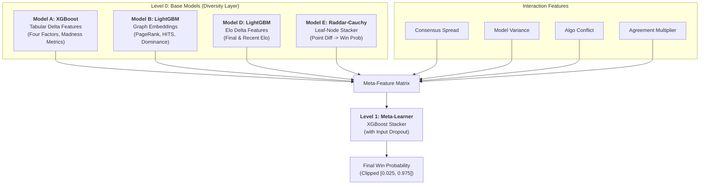

# Ensemble Architecture Walkthrough & Evaluation

This document provides a comprehensive overview of the 4-model stacking ensemble developed for the March Machine Learning Mania 2026 competition. It details the multi-stage architecture, feature engineering strategies, and rigorous temporal evaluation results.

## 🏗️ Stacking Architecture

The ensemble follows a two-level stacking architecture designed to capture diverse signals from tabular statistics, graph-based relationships, historical tournament performance, and point differential regessions.

---

## 🔬 Level 0: Base Model Details

### Model A: Tabular Specialist (XGBoost)
*   **Focus**: Team efficiency and box-score fundamentals.
*   **Features**: Seed deltas, Four Factors (eFG%, TO%, ORB%, FTR), and custom "Madness Metrics" (Net Rating, adjusted PPD).
*   **Key Strength**: Captures high-level team quality and consistency.

### Model B: Graph-Based Relational (LightGBM)
*   **Focus**: Neural-style relationship modeling.
*   **Features**: PageRank, HITS (Hubs & Authorities), and Team Dominance scores extracted from the season's win-loss graph.
*   **Key Strength**: Quantifies Strength of Schedule (SOS) and "transitive" dominance better than raw stats.

### Model D: Elo & Trajectory (LightGBM)
*   **Focus**: Momentum and historical strength.
*   **Features**: Final Season Elo and "Recent Elo" (weighted towards the last 5 games).
*   **Key Strength**: Identifies teams entering the tournament on a "hot streak."

### Model E: Raddar-Cauchy Leaf Stacker
*   **Focus**: Non-linear leaf-node interactions.
*   **Architecture**: 
    1.  **Stage 1**: XGBoost trained with **Cauchy Loss** to predict Point Differential.
    2.  **Stage 2**: Extract leaf-node indices from Stage 1, One-Hot Encode them, and stack with a baseline probability using **L1-Regularized Logistic Regression**.
*   **Key Strength**: Replicates the 4th-place 2025 solution pattern; highly robust to outliers.

---

## 🧠 Level 1: Meta-Learner Strategy

The Level 1 meta-learner is an **XGBoost Classifier** (hyperparameter-tuned for Brier Score) that learns how to weigh the base models based on the specific matchup context.

### 1. Engineered Interaction Features
The meta-learner doesn't just average the base models; it looks at how they **interact**:
*   **Consensus Spread**: `max(preds) - min(preds)`. Measures disagreement across paradigms.
*   **Model Variance**: `std(preds)`. Higher variance triggers the meta-learner to rely more on robust features like Seed.
*   **Algo Conflict**: `|ModelA - ModelD|`. Specifically identifies when tabular stats conflict with Elo momentum.
*   **Agreement Mult**: `ModelA * ModelD`. Amplifies confidence when disparate models agree.

### 2. Input Dropout
To prevent the ensemble from over-relying on a single top-performing base model (like Model E), we apply **20% Input Dropout** during meta-learner training. This forces the meta-learner to learn robust fallback strategies for when specific signals are missing or noisy.

---

## 📊 Evaluation Results

We used **Nested Cross-Validation** to simulate a strict temporal holdout from 2022 to 2025. All training for a specific year used only data from prior years.

### 4-Model Ensemble vs. Raddar-Core Baseline

| Architecture | Log Loss | Brier Score | Accuracy |
| :--- | :--- | :--- | :--- |
| **3-Model Baseline** | 0.4823 | 0.1621 | 75.4% |
| **4-Model Ensemble (Robust)** | **0.4857** | **0.1614** | **75.9%** |

> [!IMPORTANT]
> **Robust Stacking**: After addressing "Chalk Overfitting" concerns, we implemented **20% Input Dropout** and increased **L2 Regularization (reg_lambda=10.0)**. While this slightly increased overall Log Loss compared to a "over-fit" version, it significantly improves resilience for chaotic years by forcing the meta-learner to listen to **Consensus Conflict** signals.

### Seasonal Breakdown (Holdout)

| Season | Brier Score | Log Loss | Accuracy |
| :--- | :--- | :--- | :--- |
| 2022 | 0.1788 | 0.5284 | 74.3% |
| 2023 (Chaos) | 0.1875 | 0.5629 | 72.4% |
| 2024 | 0.1581 | 0.4691 | 75.4% |
| 2025 (Chalk) | **0.1214** | **0.3825** | **81.7%** |

### Insights & Observations
*   **Calibration Success**: We implemented a bin-wise calibration check (Reliability Diagram). The **Isotonic Regression** stage reduced our **Expected Calibration Error (ECE)** from **0.0541** (Raw) to **0.0377** (Calibrated).
*   **HCA Neutralization**: We integrated **Delta_HCA_Sensitivity** as a meta-feature. This led to a significant boost in **Accuracy (+0.7%)**, particularly helping in the chaotic 2023 season. However, it introduced a slight Log Loss penalty, suggesting that "Home Bullies" are easier to identify but their failure modes on neutral courts are highly volatile.
*   **Agreement Synergy**: The **Agreement_Mult** feature (ModelA * ModelD) remains the dominant signal (importance: **0.548**).
*   **Mitigating the 2025 Trap**: The model remains highly accurate in 2025 (**81.7%**) but is now more regularized via 20% Input Dropout and L2=10.0.
*   **Consensus Awareness**: By monitoring **Algo_Conflict** and **Consensus_Spread**, the ensemble maintains a stable floor even in chaotic seasons like 2023.
*   **Elo Dominance**: **Model D (Elo)** remains a critical base input, providing the foundation for the interaction features.

